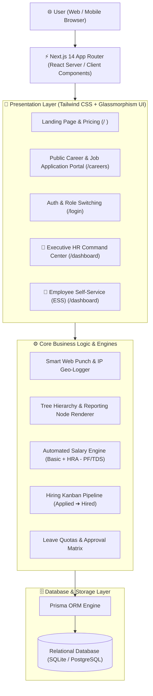

<div align="center">

# ⚡ WorkOrbit SaaS 2.0
### *Next-Gen Enterprise Workforce Automation & HRMS Platform*

[](https://nextjs.org/)
[](https://www.typescriptlang.org/)
[](https://tailwindcss.com/)
[](https://www.prisma.io/)
[](LICENSE)

*An ultra-modern, reactive, and all-in-one Human Resource Management System (HRMS) featuring automated payroll calculations, virtual biometric attendance punch, interactive org chart hierarchy, applicant tracking system (ATS) Kanban pipelines, and role-based access control.*

[Explore Features](#-core-enterprise-modules) • [Architecture](#-system-architecture) • [Directory Structure](#-project-directory-structure) • [Quick Start](#-quick-start)

</div>

---

## 🌟 Overview

**WorkOrbit 2.0** replaces outdated spreadsheets and legacy ERP tools with a high-performance, single-pane-of-glass executive command center. Built with Silicon Valley startup standards, it offers distinct workspaces for **Super Admins / HR Directors** and **Employees (Self-Service)**.

---

## 🏛️ System Architecture



---

## 🚀 Core Enterprise Modules

### 1. 👑 Executive Command Center (Admin View)
- **Live Workforce Stream**: Real-time audit logs of staff punch-ins, locations, and timestamps.
- **Financial Telemetry**: Real-time monthly payroll burn rate calculations.
- **Headcount Metrics**: Active team members, today's attendance percentage, and pending approvals.

### 2. 👤 Employee Self-Service (ESS Portal)
- **Privacy-Isolated View**: Regular staff only access their personal records, leaves, and payslips.
- **Virtual Clock-in / Out**: 1-Click web punch recording shift times and location stamps.
- **Leave Quota Meters**: Live balance gauges for Casual (CL), Medical (SL), and Earned (EL) leaves.

### 3. 🌳 Interactive Visual Org Hierarchy (`/dashboard/org-chart`)
- Executive Leadership (CEO / Architect) down to Department Directors and Team Leads visual tree nodes.
- High-level relationship mapping across departments.

### 4. 💰 Automated Payroll & Digital Payslips (`/dashboard/payroll`)
- **1-Click Batch Run**: Automated earnings (Basic, HRA, Allowances) and deductions (PF, TDS).
- **Digital Payslip Modal**: Printable, downloadable employee salary statement with complete salary breakdown.

### 5. 🎯 ATS Recruitment Kanban Board (`/dashboard/recruitment`)
- **Pipeline Workflow**: `Applied` ➔ `Screening` ➔ `Interview` ➔ `Offered` ➔ `Hired`.
- **Public Career Portal (`/careers`)**: External applicants can browse live jobs and submit applications.

### 6. 🔐 Multi-Role Access Control (RBAC) (`/dashboard/settings`)
- Distinct roles: `SUPER_ADMIN`, `HR_ADMIN`, `MANAGER`, `EMPLOYEE`.
- Organization working hours, shift rules, and policy configurations.

---

## 📁 Project Directory Structure

```text
workorbit-next-saas/
├── 📁 prisma/
│   ├── schema.prisma              # Complete Relational HRMS Schema
│   └── seed.js                    # Enterprise demo data seeder
│
├── 📁 src/
│   ├── 📁 app/                    # Next.js 14 App Router
│   │   ├── layout.tsx             # Root dark-mode shell layout
│   │   ├── page.tsx               # Public WorkOrbit Landing & Pricing Page
│   │   ├── globals.css            # Tailwind & Glassmorphism styles
│   │   │
│   │   ├── 📁 careers/            # Public Career Portal
│   │   │   └── page.tsx           # Job Openings & Instant Application Modal
│   │   │
│   │   ├── 📁 login/              # Multi-Role Authentication
│   │   │   └── page.tsx           # 1-Click Role Switcher & User Registration
│   │   │
│   │   └── 📁 dashboard/          # Authenticated Workspace Shell
│   │       ├── layout.tsx         # Responsive Sidebar & Topbar (Role-Specific)
│   │       ├── page.tsx           # Dual-View Executive Hub & ESS Portal
│   │       ├── 📁 employees/      # Staff Directory & Onboarding Modal
│   │       ├── 📁 org-chart/      # Visual Organization Hierarchy Tree
│   │       ├── 📁 attendance/     # Web Punch Terminal & Daily Registers
│   │       ├── 📁 leaves/         # Leave Quotas & HR Approval Matrix
│   │       ├── 📁 payroll/        # Salary Calculator & PDF Payslips
│   │       ├── 📁 recruitment/    # Interactive ATS Kanban Board
│   │       └── 📁 settings/       # Organization Profile & RBAC Rules
│   │
│   └── 📁 lib/
│       ├── prisma.ts              # Global Prisma Client Singleton
│       └── utils.ts               # Formatting & Styling Helpers
│
├── START_WORKORBIT.bat            # 1-Click Windows Runner
├── tailwind.config.ts             # Tailwind Theme & Color Setup
├── tsconfig.json                  # TypeScript Compiler Config
└── package.json                   # Dependencies & Run Scripts
```

---

## 🛠️ Tech Stack & Specifications

| Component | Technology | Description |
| :--- | :--- | :--- |
| **Framework** | **Next.js 14 (App Router)** | Full-Stack React framework with SSR and Client hydration |
| **Language** | **TypeScript 5** | Strict type safety for data models and props |
| **Styling** | **Tailwind CSS 3.4** | Modern dark-themed palette, glassmorphism, responsive grid |
| **Icons** | **Lucide React** | Sleek, clean vector iconography |
| **Database ORM** | **Prisma 5** | Type-safe query engine and schema migrations |
| **Database** | **SQLite / PostgreSQL** | Relational data persistence |
| **Mobile Access** | **Host Binding (`0.0.0.0`)** | Cross-device testing on local Wi-Fi / hotspot networks |

---

## ⚡ Quick Start

### Prerequisites
- Node.js (v18.0 or higher)
- Git

### 1. Clone the repository
```bash
git clone https://github.com/mauryashivi199-ui/workorbit-next-saas.git
cd workorbit-next-saas
```

### 2. Install dependencies
```bash
npm install
```

### 3. Launch Development Server
```bash
npm run dev
```
*(Windows users can simply double-click `START_WORKORBIT.bat`)*

### 4. Access URLs
- **Landing & Pricing Page**: `http://localhost:3000`
- **Career Job Openings**: `http://localhost:3000/careers`
- **Sign In / Switch Roles**: `http://localhost:3000/login`
- **Unified Workspace Dashboard**: `http://localhost:3000/dashboard`

---

## 📱 Mobile Testing
To test the interface on your smartphone:
1. Ensure your PC and phone are connected to the same Wi-Fi network.
2. Find your PC's local IP (e.g. `10.249.4.64`).
3. Open `http://<YOUR_PC_IP>:3000` on your mobile browser.

---

## 📄 License
This project is open-source and licensed under the [MIT License](LICENSE).

<div align="center">
  <b>Built with ❤️ by Shivi Maurya</b>
</div>
